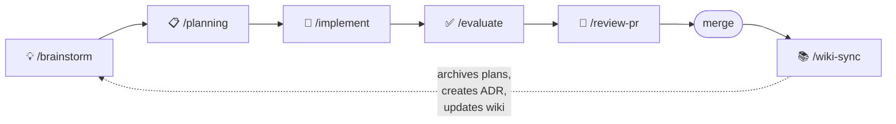
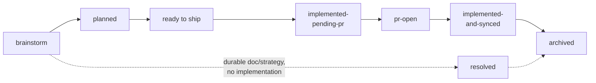

# 🧠 Team-Brain

**An LLM-native team wiki and agent-driven development workflow — in one template.**

[](https://claude.com/claude-code)
[](https://cursor.com)
[](https://openai.com/codex)
[](.agents/README.md)

Team-Brain is a reusable knowledge system for teams working across multiple repositories. It is the **synthesis layer**: repo-local docs stay authoritative for implementation details, while this repo preserves how the product concept, architecture, decisions, operations, and open questions fit together — and ships the agent skills that run a full idea-to-wiki development loop on top of it.

> **The one rule:** [`wiki/`](wiki/) contains only **decided and implemented** knowledge. Everything pre-implementation lives in [`inbox/`](inbox/) and [`plans/`](plans/).

---

## ⚡ Quick Start

1. **Clone the template** (or use it as a GitHub template repo) next to your team's repos:

   ```txt
   GitHub/
   ├── repo-a/
   ├── repo-b/
   └── team-brain/
   ```

2. **Open it in your agent tool.** The skills ship pre-installed for Claude Code (`.claude/skills/`), Cursor (`.cursor/skills/`), and Codex (`.codex/skills/`) as mirrors of the canonical [`.agents/skills/`](.agents/skills/) — no install step needed.

3. **Run `/setup-brain`.** It detects whether you're configuring a fresh template or migrating an existing wiki, walks the customization checklist ([`repos.yaml`](repos.yaml), namespaces, zones, placeholders), prunes the skill mirrors for tools you don't use, and hands off to `/skills-sync` for installing skills into your implementation repos. Re-running it later doubles as a setup health check.

---

## 🔁 The Development Loop

Every skill owns one verb. Ideas flow from exploration to durable wiki knowledge through an explicit, metadata-tracked lifecycle:



Each stage stamps lifecycle frontmatter, so any agent (or human) can pick up a file cold and know exactly where it stands:



**Implementation PRs vs. artifact PRs.** A PR that merely lands a brainstorm, plan, or strategy doc is recorded as `artifact_pr` and never advances lifecycle state. Only a PR that ships the actual deliverable gets stamped into `related_pr` and moves a phase to `pr-open` — `/review-pr` classifies every PR as `implementation`, `artifact`, or `mixed` before stamping. This keeps "we wrote the plan" from ever being mistaken for "we built it."

## 🗺️ Wiki Zones

Wiki knowledge is routed into **zones** so distinct product domains never mix on the same page:

| Zone | Contains |
|---|---|
| `wiki/<namespace>/` | Product/domain knowledge for one namespace — concept, vocabulary, architecture, app/API behavior. One zone per product, customer, domain, or workstream. |
| `wiki/platform/` | Shared implementation substrate — infrastructure, deploys, dependencies, runbooks, incidents. |
| `wiki/general/` | Team/brain workflow knowledge — lifecycle semantics, conventions, process principles. |
| `wiki/decisions/<zone>/` | ADRs, grouped by zone with global numbering and a `Namespace:` field. |
| `wiki/logs/` | Maintenance log and synced-PR ledger (fixed root path). |

**The boundary rule: route by implementation sharing, not by topic.** If changing the knowledge would force edits in more than one namespace's code, it belongs in `platform`; if it only touches one namespace's code, it belongs in that namespace's zone — even when the concept sounds shared. See [CONCEPT.md](CONCEPT.md).

## 🛠️ The Skills

| Skill | Invoke | What it does |
|---|---|---|
| `setup-brain` | `/setup-brain` | One-time (re-runnable) onboarding. **New brain**: guided fill-in of `repos.yaml`, namespaces, zones, and template placeholders. **Existing brain**: report-first migration of an existing wiki into this structure. Manages skill mirrors per agent tool and delegates implementation-repo installs to `/skills-sync`. |
| `brainstorm` | `/brainstorm <topic>` | Explore a problem before building. Saves to `inbox/dump/` on request with lifecycle frontmatter. |
| `planning` | `/planning <intent>` | Three-phase gate. Phase 1: propose breakdown (approval gate). Phase 2: write phase specs to `plans/<namespace>/<feature-slug>/` at `status: wip`. Phase 3: flip a phase to `ready to ship` only after every open question is resolved or routed. |
| `implement` | `/implement <phase>` | Implements a phase in the target repo resolved from `repos.yaml`. Resolves open questions on `wip` plans one by one, runs `/simplify`, marks the phase `implemented-pending-pr`. |
| `simplify` | `/simplify <paths>` | Scoped code-quality pass for recently changed code. Preserves behavior. |
| `evaluate` | `/evaluate <feature>` | Optional pre-PR gate. Maps each acceptance criterion to code; reports `complete` / `partial` / `missing` / `unclear` plus lifecycle link gaps. |
| `review-pr` | `/review-pr [<pr>]` | Pre-merge. Runs validation, detects linked issues, classifies the PR (`implementation` / `artifact` / `mixed`), stamps `related_pr` or `artifact_pr`, writes title + body + score via `gh`. |
| `wiki-sync` | `/wiki-sync <pr-or-doc>` | Post-merge. **PR mode**: creates/flips the ADR, updates zone pages, appends logs, archives completed lifecycle chains. **Doc mode**: ingests existing implemented knowledge. Idempotent via the synced-PR ledger. |
| `wiki-query` | `/wiki-query <question>` | Read-only retrieval. Zone-aware search; cites sources, separates stable knowledge from uncertainty. |
| `wiki-lint` | `/wiki-lint` | Periodic health audit — stale pages, dangling links, mixed-namespace pages, unresolved `repos.yaml` feeds. |
| `wiki-adr` | `/wiki-adr` | Record an ad-hoc architecture decision outside the `/planning → /wiki-sync` flow, into `wiki/decisions/<zone>/`. |
| `wiki-runbook` | `/wiki-runbook` | Document operational procedures into the zone-appropriate runbook pages. |
| `workflow-from-chats` | `/workflow-from-chats` | Mine repeated chat feedback into durable workflow guidance — skill update, runbook note, planning rule, or inbox follow-up. |
| `create-bug-issue` | `/create-bug-issue <bug>` | Capture a bug as a labeled GitHub issue in the owning repo. |
| `pr-score-log` | `/pr-score-log` | Table of merged PRs and their `review-pr` scores. |
| `rebase-onto-main` | `/rebase-onto-main` | Safe rebase onto the configured base branch with an audit report. |
| `lifecycle-audit` | `/lifecycle-audit` | Report-first cleanup for historical ideas, plans, and metadata backfill — including artifact-PR migration for files that predate the contract. |
| `skills-sync` | `/skills-sync` | Admin: sync registered skills across repos and agent surfaces while preserving repo-specific customization. |

Full reference: [.agents/README.md](.agents/README.md)

## 📁 Repository Layout

```txt
team-brain/
├── CONCEPT.md                      # wiki model, zones, lifecycle metadata, principles
├── repos.yaml                      # machine-readable source of truth: repos, ownership,
│                                   # source→wiki feeds, validation commands, skill surfaces
├── sources/
│   └── index.md                    # human-readable source map (companion to repos.yaml)
├── inbox/                          # everything pre-implementation
│   ├── fragments.md, chats.md, screenshots.md, threads.md
│   ├── open-questions.md, claims.md, backlog.md
│   └── dump/                       # /brainstorm outputs (created lazily)
├── plans/                          # active phase specs from /planning
│   └── _template/phase-N.md
├── archive/                        # completed lifecycle chains (created lazily)
│   └── <namespace>/{ideas,plans}/YYYY-MM/
├── .agents/
│   ├── README.md
│   └── skills/                     # canonical skill source
├── .claude/skills/                 # mirror for Claude Code   ┐
├── .cursor/skills/                 # mirror for Cursor        ├─ managed by /skills-sync
├── .codex/skills/                  # mirror for Codex         ┘
└── wiki/                           # decided + implemented knowledge only
    ├── index.md
    ├── logs/                       # maintenance log + synced-PR ledger
    ├── decisions/                  # ADRs under decisions/<zone>/, global numbering
    ├── product/                    # example product zone — rename to your first namespace
    ├── platform/                   # shared implementation substrate (incl. engineering/)
    └── general/                    # team workflow knowledge (created lazily)
```

## 📖 Using the Brain Day-to-Day

**Before starting work** — ask what already exists:

```txt
/wiki-query what do we know about <feature/system>?
/wiki-query which decisions affect <area>?
```

**When an idea surfaces** — explore it with `/brainstorm`; the saved dump is the bridge from "vague idea" to "ready for `/planning`". Raw half-thoughts go straight into `inbox/fragments.md` or `inbox/chats.md`.

**When it solidifies** — `/planning` writes one spec per phase under `plans/<namespace>/<feature-slug>/`, each at `status: wip` with open questions tracked explicitly. Nothing flips to `ready to ship` until every question is resolved in-place, routed to `tests.md` (empirical), or routed to `inbox/backlog.md` (deferred).

**Build it** — `/implement` consumes a phase, then `/evaluate` audits acceptance criteria if you built it yourself, then `/review-pr` validates, classifies, and stamps the PR.

**After merge** — `/wiki-sync <pr>` turns the merged PR into durable knowledge: ADR created or flipped to `accepted`, zone pages updated, tunable knobs preserved, the completed plan/idea chain archived under `archive/<namespace>/`. Incomplete chains stay active — a source idea is never archived while linked phases remain unfinished.

**Periodically** — `/wiki-lint` for wiki health, `/lifecycle-audit` for historical cleanup, `/workflow-from-chats` to turn repeated feedback into durable workflow rules.

## 🧭 Rule of Thumb

> Repo docs explain how one part works. This brain explains how the whole system fits together, why decisions were made, and what the team knows so far — with the uncertainty kept visible.

Start reading: [CONCEPT.md](CONCEPT.md) → [repos.yaml](repos.yaml) → [wiki/index.md](wiki/index.md)
